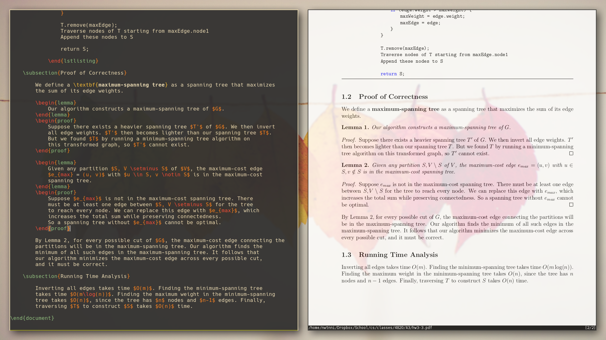
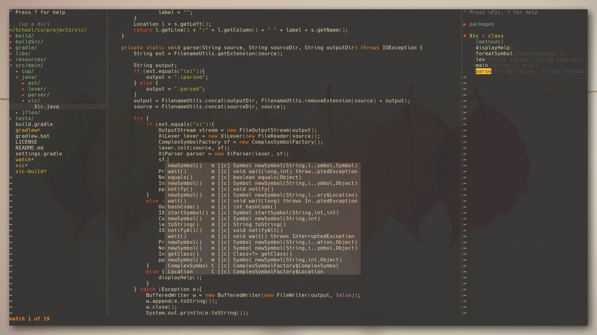

## Current Linux Mint Setup

The result of many wasted hours reading man pages and editing config files.

#### Primary Applications

- Shell: Bash
- Terminal emulator: Alacritty
- Text editor: neovim
- Window manager: i3-gaps

#### Miscellaneous Applications

- App launcher: rofi
- File browser: ranger
- Music player: cmus
- Music visualizer: cava
- PDF viewer: zathura
- Web browser: Firefox Quantum with Vimium add-on

#### Screenshots

neofetch + cmus + cava:

neovim + zathura + LaTeX:

neovim:

Wallpaper (credits to Chris Lawton and Unsplash):

